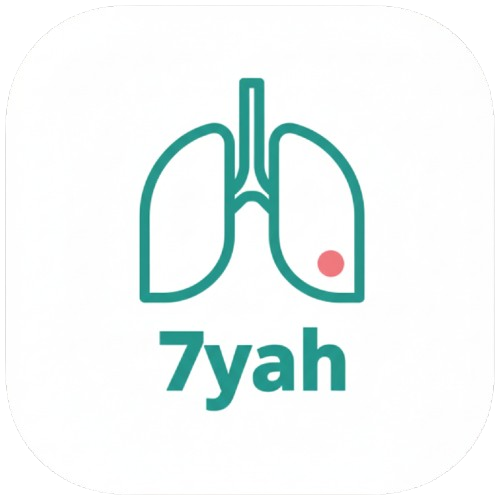

# Hi, I'm Ghada Ahmed  

**Software Engineer | Flutter & Automation Developer | Tech Instructor**  

I build **scalable mobile applications** using **Flutter & FlutterFlow**, and integrate them with backend services and APIs. I enjoy turning complex ideas into functional, user-friendly apps and workflows.  

---

## About Me
- **Education**: B.Sc. in Computer Science – Menoufia University *(Graduation Project: A+)*  
- **Core Skills:**  
 
 
 
 
 
 
  
- **Specialties:** UI/UX Design, State Management, Responsive Development  
- **Tools:** Git, Debugging, Unit Testing  

---

## Experience
- **Instructor – UpgradeX Academy** *(Jul 2025 – Present · El Sadat City, Egypt)*  
  Teaching computer skills, programming, and AI for children & adults.  

- **Instructor – BareeQ Academy** *(Jul 2024 – Dec 2024 · El Sadat City, Egypt)*  
  Taught computer basics & programming for kids; contributed to **Digital Cubs of Egypt** initiative.  

- **FlutterFlow Trainee – Gensystem** *(Feb 2024 – Apr 2024 · Remote)*  
  Designed & implemented app interfaces in FlutterFlow, integrated with Firebase & Supabase.  

- **Flutter Trainee – Career** *(May 2023 – Oct 2023 · Remote)*  
  Developed a marketplace app using Flutter + GetX + Firebase (later unpublished from Google Play).  

---

## Featured Projects

<table>
<tr>
<td align="center" bgcolor="#f0f0f0" style="padding:15px; border-radius:10px;">
<b>Élan Hotel</b> 
 
<small>FlutterFlow + n8n</small> 
<a href="https://www.linkedin.com/posts/ghada-ahmed-81b340195_flutterflow-flutterdeveloper-appdevelopment-activity-7369716813418446852-yTuS?utm_source=share&utm_medium=member_desktop&rcm=ACoAAC3KPJcBSsDGBx7QVqoXShmga7JYle2gUVo">Watch Demo</a>
</td>

<td align="center" bgcolor="#f0f0f0" style="padding:15px; border-radius:10px;">
<b>Career App</b> 
 
<small>Flutter + GetX + Firebase</small> 
<a href="https://www.linkedin.com/posts/ghada-ahmed-81b340195_flutter-getx-firebase-activity-7340075190480945253-p-DG?utm_source=share&utm_medium=member_desktop&rcm=ACoAAC3KPJcBSsDGBx7QVqoXShmga7JYle2gUVo">Watch Demo</a>
</td>

<td align="center" bgcolor="#f0f0f0" style="padding:15px; border-radius:10px;">
<b>7yah App</b>  
 
<small>Flutter + Bloc + Flask</small> 
<a href="https://www.linkedin.com/posts/ghada-ahmed-81b340195_flutter-deeplearning-machinelearning-activity-6958068763002908673-teYL?utm_source=share&utm_medium=member_desktop&rcm=ACoAAC3KPJcBSsDGBx7QVqoXShmga7JYle2gUVo">Watch Demo</a>
</td>
</tr>
</table>

---

## Currently Learning
- Advanced Flutter architecture & performance optimization  
- API-driven automation with n8n  
- AI-powered integrations in mobile apps  

---

## Connect With Me
[LinkedIn](https://www.linkedin.com/in/ghada-ahmed-81b340195)  
[GitHub](https://github.com/GhadaAhmed152420)  
[LeetCode](https://leetcode.com/u/Ghada_A/)  
Email: ga2513092@gmail.com
